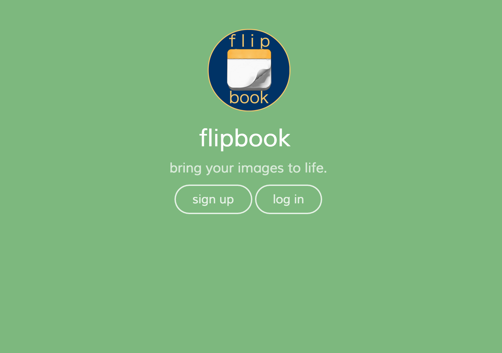
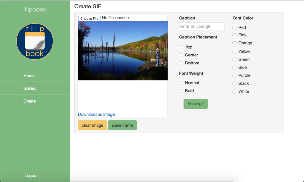
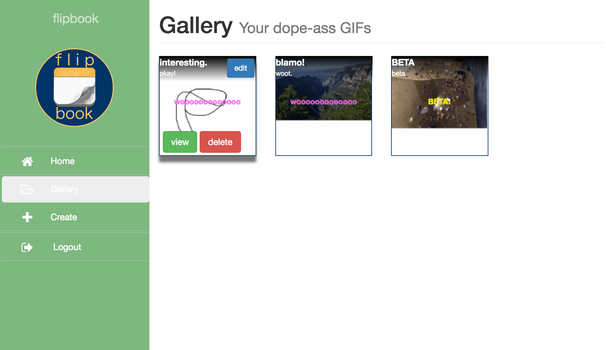

# flipbook - api

## Hosted on Github pages

View app/API here:
 [flipbook: Client](http://apalmer0.github.io/gym-news-front-end/index.html)
 [flipbook: API](https://gym-news.herokuapp.com/)

## About

flipbook is a tool for 'bringing your images to life'. With it, a user can
make a basic sketch on a blank canvas or upload an image and sketch on that,
and save each drawing as a 'frame' that
can be compiled into an animated GIF, like a
flipbook. If no image frames are selected for the GIF, the user can
use their webcam to create the GIF of themselves. In addition,
a simple caption can
be written, stylized, and placed on top of the GIF itself for added hilarity.

## General Approach

For my final project I wanted to experiement with some technologies I wasn't
really comfortable with yet; despite having just finished writing
[upBucket](http://apalmer0.github.io/upbucket-client/index.html) I was still a
shaky on Express and Node, so those were the first choices on the api
side. On the front end, I wanted to be sure to use a front-end framework. I've
been curious about Angular for a long time, so it made the most sense to dive in
headfirst and commit myself to learning it in time for this project rather than
allowing myself the freedom to tinker with it independently and indefinitely
when no deliverable is actually due.

Regarding the app itself - I wanted to build a tool that did something fun, and
I wanted to tinker with an idea I had for my side project; this was a first
draft of that idea.

Things I would do with more time:

-   Refactor my code. It's pretty apparent that I taught myself
  Angular for this project. Towards the end I began to understand
  the framework better and realized how a lot of code was misplaced,
  so I'd like to go back and clean that up.
-   It'd be cool if a user could select an
image to sketch on rather than uploading their own. I'd like to add
that feature and create a 'gallery' from which a user
can choose the background image of their GIF.
-   It'd also be cool to add a 'share' feature, that allows a user
to email/post/whatever their GIFs to their friends.
-   Currently the app is not mobile friendly. That should change.

## Planning

**Relationships & User Stories**

## Live Screenshot

**Homepage**

**Creating a GIF**

**GIF Gallery**

## Technology Used

flipbook's client side is written with Angular, Bootstrap, HTML5, and Sass. The
api is written with a MongoDB database, along with Express and Node.js for the
full MEAN stack experience.

## User Stories

Generally speaking, a user can:

-   use their email address (ideally a fake one) to sign up
-   use that email address to log in
-   get a token back from the API upon login that authenticates their session
-   upload an image as a background for a GIF
-   draw on top of the uploaded image
-   save each image as a 'frame' of a GIF
-   pick and choose which 'frames' to include in the GIF
-   add a variety of styles to a custom caption
-   turn their 'frames' into a GIF
-   view a collection of all of the GIFs they've created, and no one else's
-   view the individual GIF
-   edit the GIF's attributes (just name and a comment, for now)

## Installation

After forking/cloning, run `mongod` and `nodemon` to run Mongoose locally.
